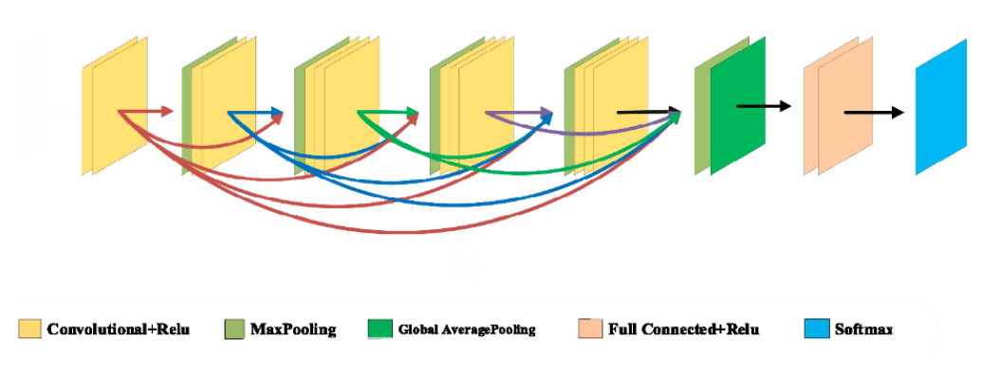

### Description

>There are alot of CNN models , we choose two (1.) [VGG-16](https://arxiv.org/pdf/1409.1556.pdf) 


(2.) [SVRNet](https://www.ncbi.nlm.nih.gov/pmc/articles/PMC8404611/pdf/JMI-008-017504.pdf)



## Requirements
We used python 3.8 to run this code. To install all requirements via pip:
```bash
$ pip install -r requirements.txt
```


## Split dataset
 To preprocess the dataset, you can run:
```bash
$ python split_dataset.py

```


## Train the model
To train the model, you can run: 
```bash
python --model_name ['VGG16', 'SVRNet']  main.py
```
