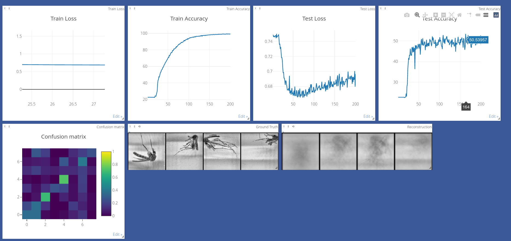
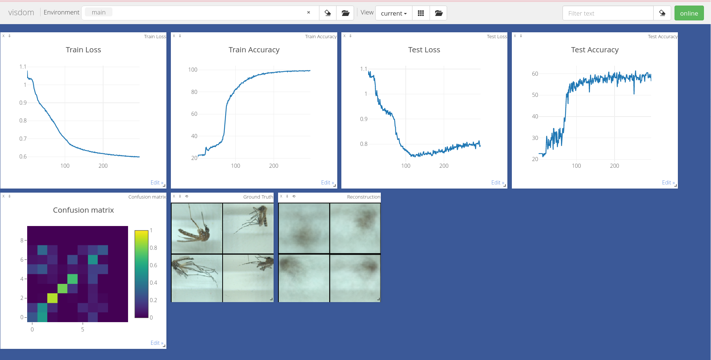

## Description

> CNNs  are one of the most researched and top-performing architectures in the field. That being said, CNNs have a few drawbacks in recognizing features of input data when they are in different orientations. To address this problem, Geoffrey E. Hinton, together with his team Sara Sabour and Nicholas Frosst, came up with a new type of Neural Network. They called them .


## Requirements

* Python 3
* PyTorch
* TorchVision
* TorchNet
* TQDM
* Visdom

## Usage

**Step 1**  splitting the datset, run:

```console
$ python3 split_data.py
```

**Step 2** Adjust the number of training epochs, batch sizes, etc.

```python
BATCH_SIZE = 100
NUM_CLASSES = 10
NUM_EPOCHS = 30
NUM_ROUTING_ITERATIONS = 3
```

**Step 3** Start training. The MNIST dataset will be downloaded if you do not already have it in the same directory the script is run in. Make sure to have Visdom Server running!

```console
$ python3 -m visdom.server & python3 capsule_network.py
```

For RGB images run:

```console
$ python3 -m visdom.server & python3 capsule_rgb.py
```

