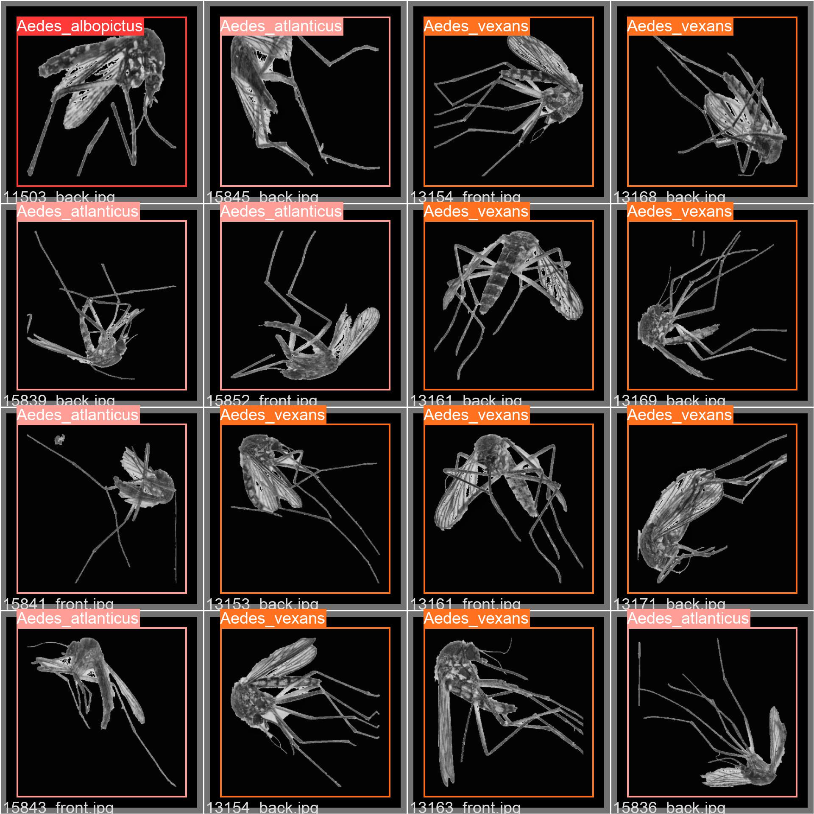
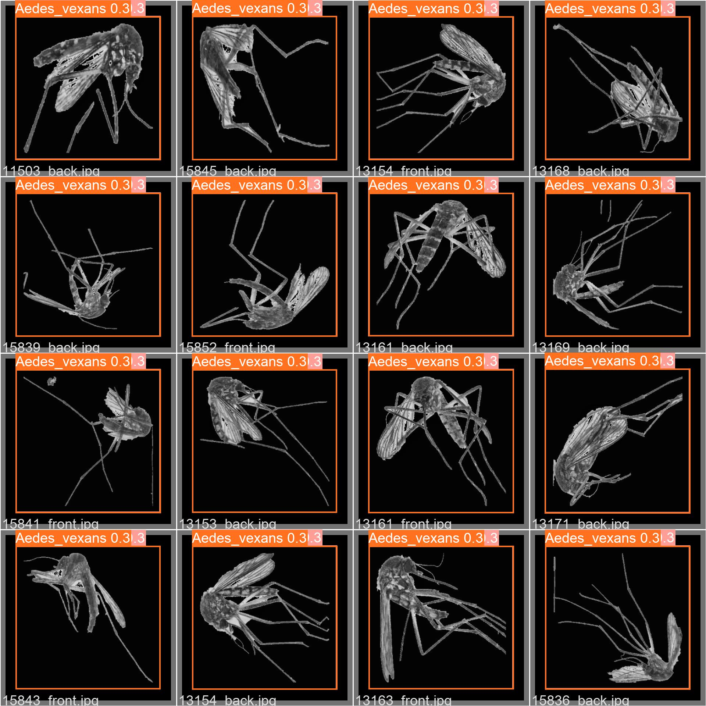

# YOLO
In this repository we crated object detection model that can localize and classify the culvert area in DEM images. We train Yolo v5 in our custom datset. YOLO, or You Only Look Once, is one of the most widely used deep learning based object detection algorithms out there.

## Preprocessing the dataset

Follow the instructions in ``yolo.ipynb ``. Eventually, you will get  two folders ``images`` and ``annotations``


## Convert the Annotations into the YOLO v5 Format
 We convert annotations into the format expected by YOLO v5. There are a variety of formats when it comes to annotations for object detection datasets. Annotations for our dataset follow the PASCAL VOC XML format, which is a very popular format. 
 
 ```bash
 python convert.py
 ```

Rename the annotations folder to labels, as this is where YOLO v5 expects the annotations to be located in.

```bash
mv annotations labels
```

## Set up the yolov5 code
Recommend you create a new conda  environment to run your YOLO v5 experiments as to not mess up dependencies of any existing project. 
```bash
git clone https://github.com/ultralytics/yolov5
cd yolov5
pip install -r requirements.txt
```
create in `yolov5/data`  a new file called `mosq.yaml`

### Hyperparameter Config File
The hyperparameter config file helps us define the hyperparameters for our neural network. We are going to use the default one, `data/hyp.scratch.yaml`

## Train the Model
To train the model run:
```bash
python train.py --img 450 --cfg yolov5s.yaml --hyp hyp.scratch.yaml --batch 32 --epochs 100 --data mosq.yaml --weights yolov5s.pt --workers 1 --name yolo_mosq_det
```


## Test the model
To test your model run:
```bash
python val.py --img 450 --weights runs/train/yolo_mosq_det/weights/best.pt --data mosq.yaml --task test --name yolo_det

```
## Show some results 
### A batch of images


### A predicted batch images



